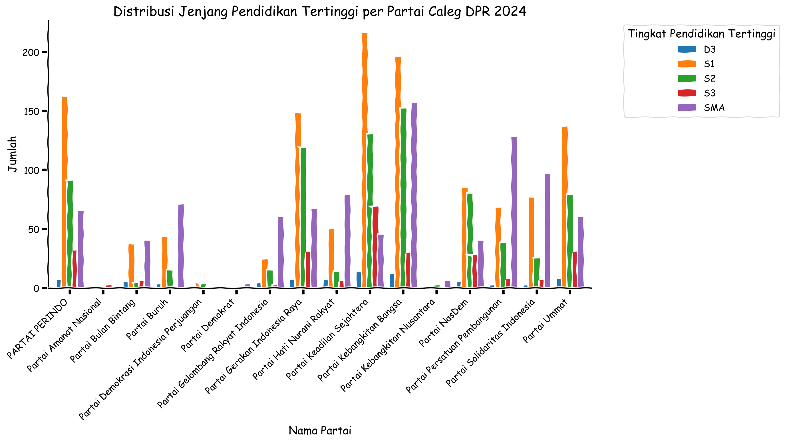
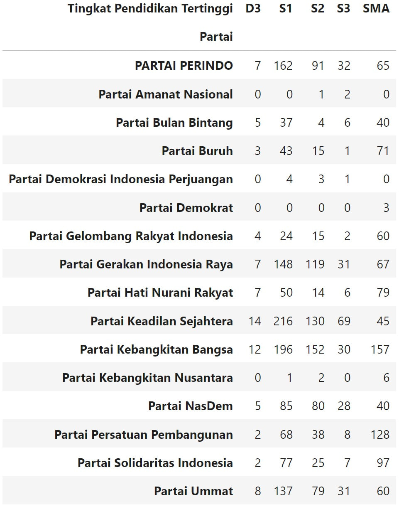
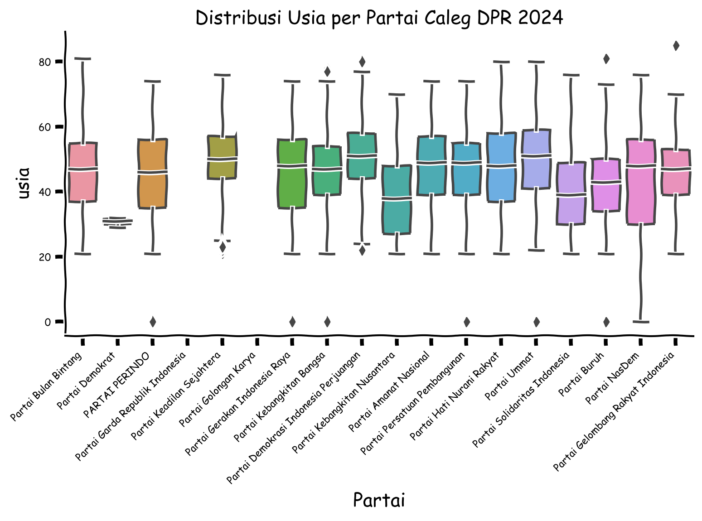
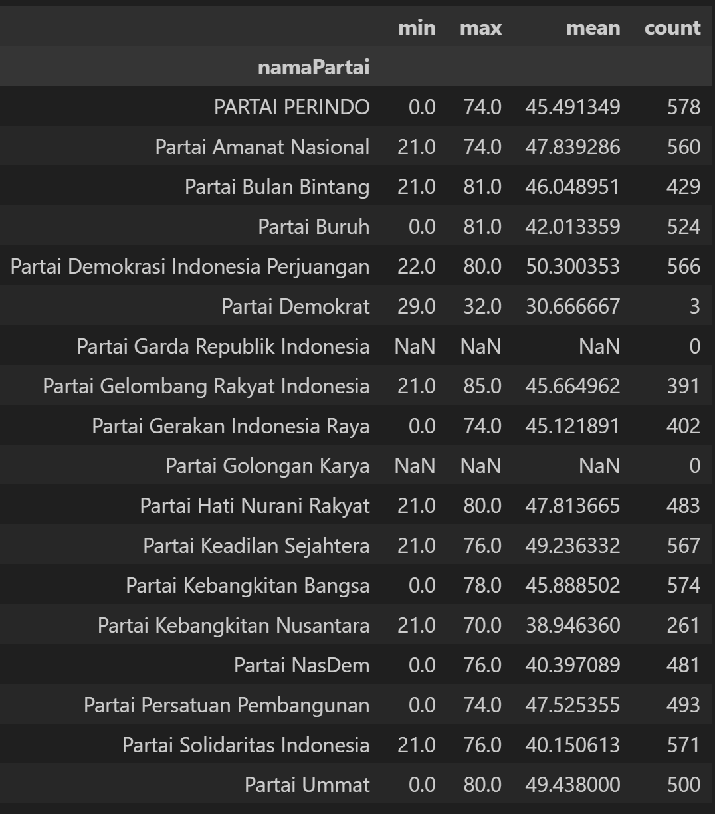

Siklus 5 tahunan, crawling data caleg DPR 2024 via https://caleg.zakiego.com/list-api#dpr-ri

Special thanks to [zakiego](https://github.com/zakiego/api-caleg-pemilu-2024) yang sudah menyediakan API untuk semua caleg DPD, DPR, DPRD provinsi, dan DPRD kota

tools:
- scrapy
- chatGPT

code fully copas chatgpt :)

## Sebaran 2 Variable
### Umur
Dari 9917 caleg DPR, hanya 3264 caleg yg ada data pendidikannya





### Usia





## Sample Kolom dan Data
```
{
    "id": "jawa-tengah-ii/partai-keadilan-sejahtera/6",
    "namaPartai": "Partai Keadilan Sejahtera",
    "logoPartai": "berkas-sipol/parpol/profil/gambar_parpol/1656395115_lambang_pks.png",
    "dapilId": "3302",
    "namaDapil": "JAWA TENGAH II",
    "nomorUrut": 6,
    "pasFoto": "https://infopemilu.kpu.go.id/dct/berkas-silon/calon/425924/pas_foto/1689257031_53b248bd-eab5-41be-a6a5-957a0676c6f4.jpeg",
    "nama": "apt. LIANA WULANSARI, S.Far.",
    "jenisKelamin": "perempuan",
    "pilihanPublikasi": null,
    "statusPublikasi": "Bersedia",
    "tempatLahir": "MEMPAWAH",
    "usia": 40,
    "agama": "Islam",
    "statusDisabilitas": "Bukan Penyandang Disabilitas",
    "pekerjaan": "SWASTA/WIRASWASTA/LAINNYA",
    "riwayatPekerjaan": [
        {
            "namaPerusahaanLembaga": "PT. Hartono Istana Teknologi \u2013 Kudus",
            "jabatan": "Penanggung Jawab Teknis",
            "tahunMasuk": "2021",
            "tahunKeluar": "2022"
        },
        {
            "namaPerusahaanLembaga": "Apotek Skalisfarma \u2013 Kudus",
            "jabatan": "Apoteker",
            "tahunMasuk": "2023",
            "tahunKeluar": "2023"
        }
    ],
    "statusHukum": "Tidak Memiliki Status Hukum",
    "riwayatPendidikan": [
        {
            "jenjangPendidikan": "SMA",
            "namaInstitusi": "SMAN 1 MENPAWAH",
            "tahunMasuk": "1997",
            "tahunKeluar": "2000"
        },
        {
            "jenjangPendidikan": "SMA",
            "namaInstitusi": "SMAN 1 Mempawah",
            "tahunMasuk": "1997",
            "tahunKeluar": "2000"
        },
        {
            "jenjangPendidikan": "S1",
            "namaInstitusi": "Universitas Ahmad Dahlan \u2013 Yogyakarta",
            "tahunMasuk": "2000",
            "tahunKeluar": "2004"
        },
        {
            "jenjangPendidikan": "S1",
            "namaInstitusi": "Universitas Ahmad Dahlan \u2013 Yogyakarta",
            "tahunMasuk": "2005",
            "tahunKeluar": "2006"
        }
    ],
    "riwayatKursusDiklat": null,
    "riwayatOrganisasi": null,
    "riwayatPenghargaan": null,
    "programUsulan": [
        "Pendidikan dan kesehatan gratis untuk rakyat: "
    ],
    "motivasi": null
}
```